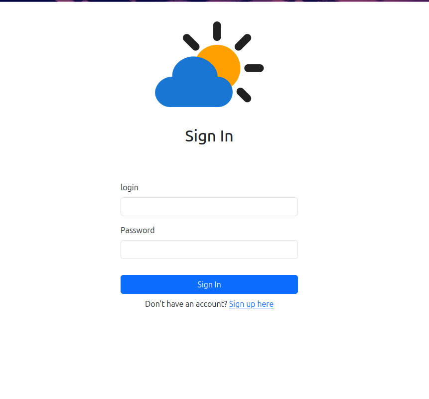
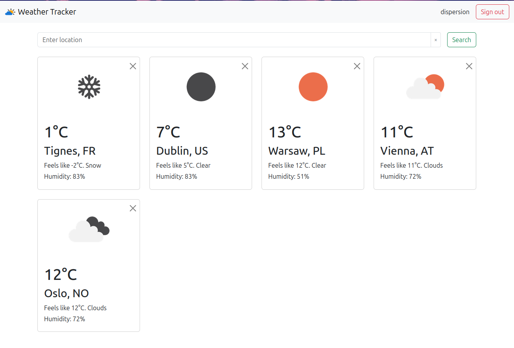
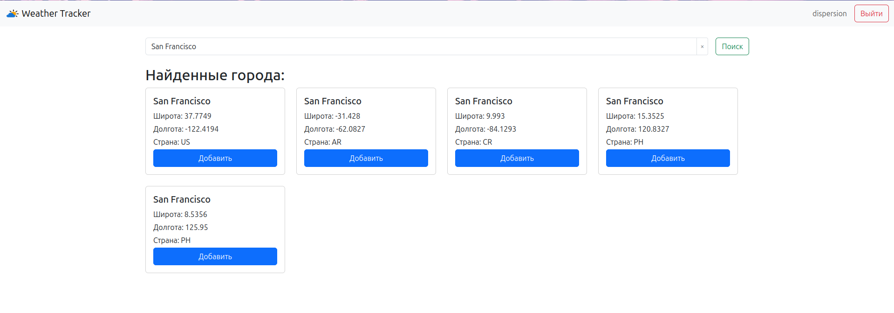

# ☁️ Проект "Погода"
<hr>

## Описание
<hr>
Веб-приложение для просмотра текущей погоды. 
Пользователь может зарегистрироваться и добавить в коллекцию одну или 
несколько локаций (городов, сёл, других пунктов), 
после чего главная страница приложения начинает отображать список локаций с
их текущей погодой.

### Деплой: http://37.252.19.242:8081 (пока не работает)

# Использованные технологии / инструменты
<hr/>

### Backend


### Тестирование


### Фронтенд


### Deploy


## Диаграмма базы данных


## Зависимости
+ Java 21
+ Apache Maven
+ Tomcat 11
+ Intellij IDEA
+ OpenWeather Api Key

## Функционал


### Регистрация

Адрес - `/auth/sign-up`
- Регистрация пользователя по уникальному логику и паролю
- Подтверждение пароля для успешной регистрации


### Авторизации

Адрес - `/auth/sign-in`
- Авторизация пользователя по существующему логину и паролю




### Главная страница

Адрес - `/weather`

- Просмотр погоды сохранненых локаций
- Поиск локаций
- Выход из аккаунта



### Страница поиска локаций

Адрес - `/weather/search-results`

- Поиск локаций
- Добавление локаций на главную страницу




<hr/>

## Установка и запуск через Docker

### 1. Клонирование репозитория
- Перейдите в папку, где хотите хранить проект.
- Откройте консоль и выполните команды:
  ```bash
  git clone https://github.com/0-Luntik-0/weather.git
  cd weather
  ```

### 2. Настройка файла `.env`

- API вы можете взять на сайте -> [openweathermap](https://openweathermap.org/api)
- Для этого придеться зарегестрироваться и получить API ключ (лимит 60 запросов в минуту)

<hr/>

- Переименуйте файл `.env.example` в `.env` и заполните своими данными:
- 
  ```properties
  # Database
  DB_NAME=your_db_name
  DB_USERNAME=your_user
  DB_PASSWORD=your_password

  # OpenWeather
  OPENWEATHER_API_KEY=your_api_key
  ```

### 3. Подготовка к запуску приложения
- Убедитесь, что установлены Docker и Docker Compose. Проверьте версии:
  ```bash
  docker --version
  docker compose version
  ```
- Если вывод примерно такой:
  ```bash
  Docker version 28.0.4, build b8034c0
  Docker Compose version v2.34.0
  ```
  переходите к следующему шагу. Иначе установите Docker и Docker Compose.

### Для Windows и macOS:

- Скачайте и установите Docker Desktop с [официального сайта Docker](https://www.docker.com/products/docker-desktop)
- Запустите Docker Desktop и дождитесь его полной загрузки.
- Проверьте установку в терминале:

```bash
docker --version
docker compose version
```

### Для Linux:
- Установите Docker [по официальной документации](https://docs.docker.com/engine/install/)
- Установите Docker Compose [по официальной документации](https://docs.docker.com/desktop/setup/install/linux/)
- Проверьте установку в терминале:

```bash
docker --version
docker compose version
```
### 4. Запуск приложения
- В папке проекта выполните:
  ```bash
  docker compose up --build
  ```

### 5. Доступ к приложению
- Откройте браузер и перейдите по адресу:
  ```
  http://localhost:8080
  ```

### Остановка и очистка
- Чтобы остановить контейнеры и удалить данные:
  ```bash
  docker compose down -v
  ```

### Что внутри Docker?
- **PostgreSQL**:
  - Данные в томе `postgres_data`.
  - Порт: `5433` (хост) → `5432` (контейнер).
- **Adminer**:
  - Веб-интерфейс для БД.
  - Доступ: `http://localhost:5050` (логин/пароль из `.env`).
- **Приложение**:
  - Собирается из `Dockerfile`.
  - Порт: `8080` (хост) → `8080` (контейнер).
  - Подключается к БД через сеть Docker.