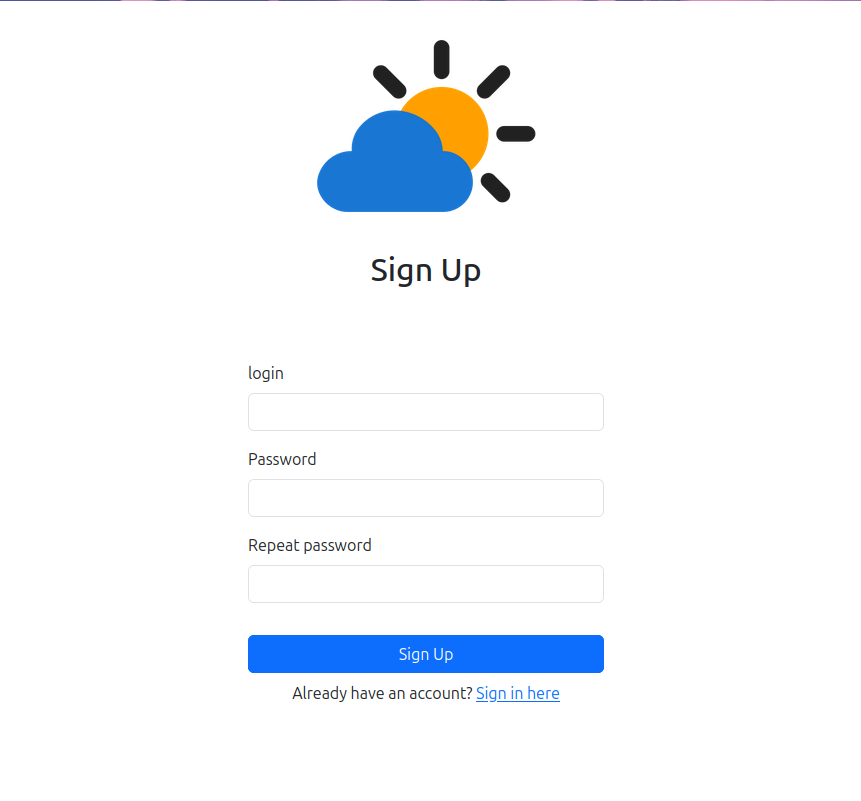
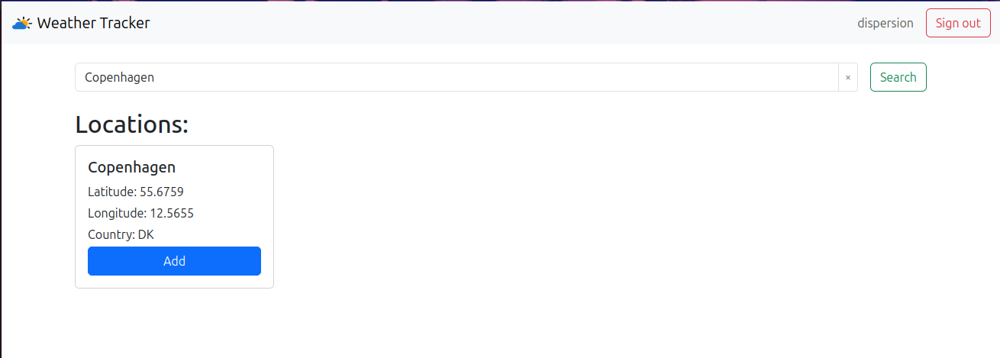

# ☁️ Проект "Погода"
<hr>

## Описание
<hr>
Веб-приложение для просмотра текущей погоды. 
Пользователь может зарегистрироваться и добавить в коллекцию одну или 
несколько локаций (городов, сёл, других пунктов), 
после чего главная страница приложения начинает отображать список локаций с
их текущей погодой.

### Деплой: http://37.252.19.242:8081

# Использованные технологии / инструменты
<hr/>

### Backend


### Тестирование


### Фронтенд


## Диаграмма базы данных


## Зависимости
+ Java 21+
+ Apache Maven
+ Tomcat 11
+ Intellij IDEA
+ OpenWeather Api Key

## Функционал


### Регистрация

Адрес - `/auth/sign-up`
- Регистрация пользователя по уникальному логику и паролю
- Подтверждение пароля для успешной регистрации



### Авторизации

Адрес - `/auth/sign-in`
- Авторизация пользователя по существующему логину и паролю

  


### Главная страница

Адрес - `/weather`

- Просмотр погоды сохранненых локаций
- Поиск локаций
- Выход из аккаунта


### Страница поиска локаций

Адрес - `/weather/search-results`

- Поиск локаций
- Добавление локаций на главную страницу




<hr/>

## Установка проекта

Следуйте этим шагам, чтобы настроить и запустить проект на своей машине:

### 1. Клонирование репозитория:

   Откройте терминал и выполните команду:

 `git clone https://github.com/0-Luntik-0/weather.git`

  `cd ВАША-ПАПКА`
### 2. Настройка PostgreSQL

1. Установите PostgreSQL, если он ещё не установлен, и запустите сервер.
2. Создайте базу данных: 

```properties
CREATE DATABASE project_weather
```

3. Переименуйте файл src/main/resources/hibernate.properties.origin в hibernate.properties и укажите свои данные для подключения к PostgreSQL: 

```properties
hibernate.driver_class=org.postgresql.Driver
hibernate.connection.url=jdbc:postgresql://localhost:5432/project_weather
hibernate.connection.username=YOUR_USERNAME
hibernate.connection.password=YOUR_PASSWORD

hibernate.dialect=org.hibernate.dialect.PostgreSQLDialect
hibernate.show_sql=true

API=YOUR_API_KEY
```
### Сборка и запуск приложения на Tomcat

1. **Перейдите в директорию проекта:**
   ```bash
   cd ВАША_ПАПКА
   ```

2. **Соберите проект и установите зависимости:**
   ```bash
   mvn clean install
   ```

3. **Развертывание на Tomcat**

   **Если используете внешний Tomcat:**

    - Найдите сгенерированный WAR-файл (обычно находится в `target/ВАШ_ПРОЕКТ.war`).
    - Скопируйте WAR-файл в папку `webapps` вашего Tomcat:
      ```bash
      cp target/ВАШ_ПРОЕКТ.war /путь_к_Tomcat/webapps/
      ```
    - Запустите Tomcat:
      ```bash
      cd /путь_к_Tomcat/bin
      ./startup.sh   # для Linux/macOS
      startup.bat    # для Windows
      ```
    - Перейдите в браузере по адресу:
      ```
      http://localhost:8080/
      ```

4. **Запуск в IntelliJ IDEA**

    - Откройте проект в IntelliJ IDEA.
    - Перейдите в **Run | Edit Configurations**.
    - Нажмите `+` и выберите **Tomcat Server | Local**.
    - Укажите путь к установленному Tomcat.
    - В разделе **Deployment** нажмите `+` и добавьте ваш WAR-файл.
    - Убедитесь, что Tomcat настроен на порт `8080`.
    - Нажмите **Apply** и **OK**.
    - Запустите конфигурацию с помощью **Run** или **Debug**.
    - Откройте в браузере:
      ```
      http://localhost:8080/
      ```


